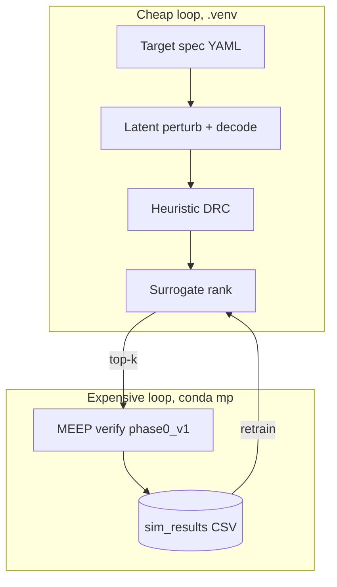

# Nanophotonics Inverse Design

**Reproducible MEEP-gated search benchmark for DRC-feasible 1x2 power splitters.**

A frozen forward model (`phase0_v1`), sim-budget replication, documented negative
results (broadband, morph, IL), and scripts to extend the manifold, rank, MEEP
verify, corpus pattern. Simulation only. This is not deployment-ready PIC IP.

| | |
|---|---|
| **License** | [MIT](LICENSE) |
| **Python** | 3.12.12 (`.venv`) |
| **MEEP** | conda env `mp`, see [setup](docs/MEEP_SETUP.md) |
| **Preprint** | [docs/preprint/manuscript.pdf](docs/preprint/manuscript.pdf) |
| **Cite** | [CITATION.cff](CITATION.cff) |

Start here: [installation](docs/INSTALL.md), [sim recipe](docs/sim_recipe_phase0.md), [preprint](docs/preprint/manuscript.pdf).

---

## Quick start

```bash
git clone https://github.com/pberlizov/nanophotonics-inverse-design.git
cd nanophotonics-inverse-design
bash scripts/setup.sh
source .venv/bin/activate
python scripts/verify_setup.py

# Refresh preprint artifacts, PDF, Zenodo bundle (CPU-only)
bash scripts/finalize_preprint_v1.sh

# Read the preprint
open docs/preprint/manuscript.pdf   # macOS; or xdg-open / evince on Linux
```

MEEP verification requires `conda activate mp`. Always invoke it via
`bash scripts/run_meep.sh ...`. See [docs/INSTALL.md](docs/INSTALL.md).

---

## What we proved, and what we didn't

| | In scope (documented) | Out of scope (do not claim) |
|---|------------------------|-----------------------------|
| **Primary result** | MEEP-gated surrogate search improves verified 50/50 split yield per sim dollar under frozen `phase0_v1` | "Fewer MEEP calls" as a lead without budget context |
| **Pipeline** | Reproducible decode, rank, MEEP verify, corpus; `repro_manifest.json` | Surrogate-only sign-off |
| **Negative science** | Broadband hunt (0 flat winners), morph stress sensitivity, IL/split tradeoffs | C-band WDM, morph robustness, low IL |
| **Sim budget** | Six-seed pilot: `surrogate_rank` 15.0 +/- 3.2 in-spec vs 10.6 +/- 4.8 for sigma-only at B=100 | Definitive n=20 policy ordering |
| **Validation** | Simulation-only 2D TE MEEP | Foundry DRC, fab yield, calibrated IL |

Methods and claims are documented in the preprint (`docs/preprint/manuscript.pdf`).

---

## Table of contents

1. [Summary](#1-summary)
2. [Architecture](#2-architecture)
3. [Installation](#3-installation)
4. [Repository layout](#4-repository-layout)
5. [Verified results](#5-verified-results)
6. [Implementation status](#6-implementation-status)
7. [Limitations](#7-limitations)
8. [Re-verify locally](#8-re-verify-locally)
9. [Command reference](#9-command-reference)
10. [Documentation index](#10-documentation-index)
11. [Contributing](#11-contributing)

---

## 1. Summary

This repo implements MEEP-native inverse design on a DRC-feasible photonic
manifold (`external/drcgenerator`):

1. **Search** on-manifold (sigma-perturbation, Perlin, MEEP-driven BO).
2. **Optionally pre-filter** with a surrogate (ranking only, not sign-off).
3. **Verify** every promoted design with MEEP (`phase0_v1`).
4. **Active learning:** append labels, retrain the ranker.

### Headline findings (MEEP-verified)

| Finding | Source |
|---------|--------|
| `ref_published` splits **0.614** in our MEEP template (not 50/50) | `data/phase0/calibration_phase0_v1.json` |
| Champion `local_00022` reaches **0.500** split at **0.47%** pixel Hamming from ref | `data/phase1/novelty/novelty_report.json` |
| At **B=100**, surrogate pre-filter **15.0 +/- 3.2** in-spec vs **10.6 +/- 4.8** (sigma-only), six seeds | [docs/SIM_BUDGET_REPLICATION_RESULTS.md](docs/SIM_BUDGET_REPLICATION_RESULTS.md) |
| Surrogate: `ranking_wins: true`; val R-squared < 0, so pre-filter only | `data/phase1/wedge_a/ranking_eval.json` |

The honest pitch is MEEP search with an optional pre-filter, not ML regression.

---

## 2. Architecture



| Component | Module / scripts | Status |
|-----------|------------------|--------|
| Manifold decode | `nano_inv.manifold`, `decode_batch.py` | Done |
| Heuristic DRC | `nano_inv.drc_heuristic` | Done (not foundry DRC) |
| MEEP forward model | `nano_inv.meep_sim`, `run_fdtd_batch.py` | Done, `phase0_v1` |
| Surrogate ranker | `train_wedge_a_surrogate.py`, `evaluate_surrogate_ranking.py` | Done |
| Sim-budget study | `run_sim_budget_study.py`, 6x replicate | Done |
| Active learning | `run_wedge_a_round.py` | Done, round 1 |
| Fab validation | | Not started |

---

## 3. Installation

Two environments:

| Env | Purpose | Activate |
|-----|---------|----------|
| **`.venv`** (Python 3.12.12) | Decode, ML, reporting | `source .venv/bin/activate` |
| **`mp`** (conda) | MEEP FDTD | `bash scripts/run_meep.sh ...` |

```bash
bash scripts/setup.sh
source .venv/bin/activate
python scripts/verify_setup.py
```

| Doc | Content |
|-----|---------|
| [docs/INSTALL.md](docs/INSTALL.md) | Python + `drcgenerator` |
| [docs/MEEP_SETUP.md](docs/MEEP_SETUP.md) | Conda MEEP env `mp` |
| [docs/sim_recipe_phase0.md](docs/sim_recipe_phase0.md) | Frozen forward model |

---

## 4. Repository layout

```
nanophotonics-inverse-design/
|-- README.md
|-- LICENSE, CITATION.cff, CONTRIBUTING.md
|-- configs/                  phase0, wedge_a YAMLs
|-- src/nano_inv/             core library
|-- scripts/                  CLI orchestrators
|-- external/drcgenerator/    manifold decode (submodule)
|-- data/                     MEEP labels, release artifacts (gitignored)
|-- docs/
|   |-- INSTALL.md, MEEP_SETUP.md         setup
|   |-- SIM_BUDGET_REPLICATION*.md        budget protocol + results
|   |-- phase0_results.md, phase1_results.md
|   `-- preprint/manuscript.pdf           citable methods and results
`-- tests/
```

---

## 5. Verified results

Cross-checked against `data/`. Re-run [section 8](#8-re-verify-locally) after
new MEEP campaigns.

### Definitions

| Term | Definition |
|------|------------|
| **In-spec** | `\|split_ratio_upper - 0.5\| <= 0.05` at 1550 nm under `phase0_v1` |
| **Sim-budget B** | Exactly **B** MEEP simulations consumed by a policy |

### MEEP calibration

Source: `data/phase0/calibration_phase0_v1.json`

| Case | Split ratio |
|------|-------------|
| `empty_flip_y` / `full_flip_y` | **0.500** |
| `ref_published_flip_y` | **0.614** (expected in our template) |

### Champions

| ID | MEEP split | Source |
|----|------------|--------|
| `local_00022` | **0.500466** | `data/phase1/meep_search_local/top_candidates.csv` |
| `meep_bo_00128` | **0.509190** | `data/phase1/meep_search_deep/top_candidates.csv` |
| `meep_bo_00093` | **0.497288** | `data/phase0/sim_results_phase0_final.csv` |

### Sim-budget (six-seed pilot, B=100)

Canonical: [docs/SIM_BUDGET_REPLICATION_RESULTS.md](docs/SIM_BUDGET_REPLICATION_RESULTS.md)

| Policy | n_in_spec (mean +/- std) |
|--------|-------------------------|
| **`surrogate_rank`** | **15.0 +/- 3.2** |
| `hierarchical_35` | 14.8 +/- 3.5 |
| `sigma_meep` | 10.6 +/- 4.8 |

Readout: this supports the surrogate pre-filter at B=100, but the CIs overlap
with `hierarchical_35`. Do not claim a definitive ordering until the n=20
replication completes.

### Release audits (negative results)

| Topic | Release file | v1 result |
|-------|--------------|-----------|
| Broadband flatness | `data/phase1/release/broadband_hunt.md` | 0 verified winners |
| IL / flux | `data/phase1/release/flux_il_audit.md` | Diagnostic, not a product gate |
| Morph stress | `data/phase1/release/champion_fab_stress.md` | Sensitivity documented |

---

## 6. Implementation status

| Phase | Status | Notes |
|-------|--------|-------|
| **Phase 0**, prove the loop | Complete | 512-label corpus, MEEP search |
| **Phase 1**, wedge + replication | Complete (six-seed) | n=20 optional extension |
| **Phase 2**, fab validation | Not started | Fab correlation, calibrated IL |

---

## 7. Limitations

| Topic | Implication |
|-------|-------------|
| Surrogate R-squared negative on holdout | Pre-filter only; MEEP promotes |
| Heuristic DRC | Not a foundry rule deck |
| Simulation-only | No fab correlation |
| Six-seed budget study | Label as a pilot; n=20 in progress |
| Champions not all in the 512-row corpus | Search finds winners outside batch labels |

---

## 8. Re-verify locally

```bash
source .venv/bin/activate

python -c "
import pandas as pd
df = pd.read_csv('data/phase0/sim_results_phase0_v1_all.csv')
print('rows', len(df), 'in_spec', ((df.split_ratio_upper-0.5).abs()<=0.05).sum())
"

python -c "import json; print('ranking_wins', json.load(open('data/phase1/wedge_a/ranking_eval.json'))['ranking_wins'])"

python scripts/check_preprint_v1_readiness.py
```

---

## 9. Command reference

### Primary workflows

| Goal | Command |
|------|---------|
| Smoke test | `python scripts/verify_setup.py` |
| Preprint + Zenodo bundle | `bash scripts/finalize_preprint_v1.sh` |
| Zenodo zip only | `bash scripts/build_zenodo_bundle.sh` |
| Wedge A sim-budget | `bash scripts/run_wedge_a.sh --full` |
| Aggregate replicates | `python scripts/aggregate_sim_budget_replicates.py --config configs/wedge_a_production.yaml` |
| MEEP batch | `bash scripts/run_meep.sh scripts/run_fdtd_batch.py --manifest ...` |

Full script index: [scripts/README.md](scripts/README.md).

### Script groups

| Group | Examples |
|-------|----------|
| Decode / DRC | `decode_batch.py`, `verify_setup.py` |
| MEEP | `run_fdtd_batch.py`, `calibrate_meep.py` |
| Search | `meep_search.py`, `meep_search_local.py` |
| Surrogate | `train_wedge_a_surrogate.py`, `evaluate_surrogate_ranking.py` |
| Wedge A | `run_sim_budget_study.py`, `run_wedge_a_round.py` |
| Release | `build_repro_manifest.py`, `build_zenodo_bundle.sh`, `check_preprint_v1_readiness.py` |

---

## 10. Documentation index

| Document | Use when |
|----------|----------|
| [docs/INSTALL.md](docs/INSTALL.md) | Python + drcgenerator setup |
| [docs/MEEP_SETUP.md](docs/MEEP_SETUP.md) | Conda MEEP env |
| [docs/preprint/manuscript.pdf](docs/preprint/manuscript.pdf) | Citable methods and results |
| [docs/SIM_BUDGET_REPLICATION.md](docs/SIM_BUDGET_REPLICATION.md) | Budget protocol |
| [docs/SIM_BUDGET_REPLICATION_RESULTS.md](docs/SIM_BUDGET_REPLICATION_RESULTS.md) | Budget tables |
| [docs/RECIPE_SENSITIVITY.md](docs/RECIPE_SENSITIVITY.md) | MEEP recipe sensitivity |
| [docs/sim_recipe_phase0.md](docs/sim_recipe_phase0.md) | Frozen forward model recipe |
| [CONTRIBUTING.md](CONTRIBUTING.md) | Issues, tests, PRs |

---

## 11. Contributing

- **Contributing:** [CONTRIBUTING.md](CONTRIBUTING.md), issues, `pytest tests/`, MEEP env notes.
- **Zenodo:** `bash scripts/build_zenodo_bundle.sh` builds `data/phase1/release/nanophotonics_preprint_v1.zip`.
- **Citation:** [CITATION.cff](CITATION.cff).

---

*If a number in this README disagrees with a file under `data/`, trust the file and open an issue.*
