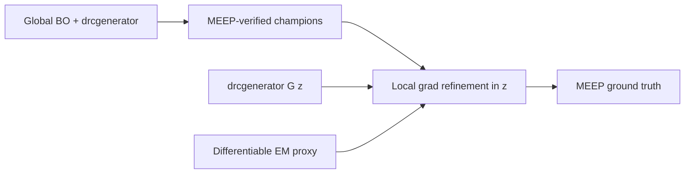

# Differentiable inverse design — strategic roadmap

**Paper:** Danis et al., *Intrinsically DRC-Compliant Nanophotonic Design via Learned Generative Manifolds* ([arXiv:2602.03142](https://arxiv.org/abs/2602.03142), Feb 2026)  
**Status:** Planning (2026-06)  
**Related:** [MEEP_RESEARCH_ARC.md](MEEP_RESEARCH_ARC.md), [RECIPE_SENSITIVITY.md](RECIPE_SENSITIVITY.md)

---

## Critical repo fact

**`external/drcgenerator` is the paper’s generator.** It is not a separate legacy manifold to replace — it *is* `EBeamModel` / `PhotoLithoModel` (Flax/JAX, morphological closing, cascaded upsampling). We already wrap it in `src/nano_inv/manifold.py`.

What we **do not** have yet:

| Paper stack | Our stack today |
|-------------|-----------------|
| Optimize **z** with **gradients** through G(z) and EM | **Optuna BO** in z; surrogate ranks; MEEP verifies |
| Differentiable **FDTD/FDFD** in the loop | MEEP (non-diff) + optional Tidy3D cross-check |
| Topological **DRC loss** during generator training | Frozen pretrained weights only |
| Continuous **ρ** during optimization | Hard binarize at generator output (`lax.select` @ 0.5) |

The strategic move is **not** “swap drcgenerator for a new network” — it is **wire gradients through the manifold we already ship** and add **local refinement** on top of global BO.

---

## Path comparison (honest)

### Path A — Differentiable manifold + diff EM (paper-native)

**Pros:** ~5× fewer EM evals in their benchmarks; DRC by construction; continuous geometry avoids pixel/raster mesh pathology.  
**Cons:** Local optima (their Fig. 3 — pixel method can beat generator loss); third solver if using Ceviche FDFD; Tidy3D grad runs cost credits.

### Path B — Surrogate gradients (our partial stack)

**Cons:** Holdout R² ≈ **−0.6** → gradients unreliable. Deprioritize until rank-aware or physics-informed surrogate exists.

### Recommended hybrid (your synthesis)



1. **Keep** BO + MEEP for global exploration (proven champions ~0.50).  
2. **Optional** fine-tune G on our corpus: L_topo (Eq. 3) + reconstruction vs frozen drcgenerator decodes.  
3. **Add** gradient descent from champion latents using diff EM (Tidy3D `invdes` / Ceviche), **MEEP promotes**.  
4. **Do not** throw away Phase 0/1 results — refinement is additive.

---

## Known risks (from paper + our data)

| Risk | Mitigation |
|------|------------|
| Grad descent → **local optima** | BO seeds; multi-start from top-k champions |
| **FDFD vs FDTD** mismatch (Ceviche) | Use Tidy3D invdes for FDTD-aligned grad where budget allows; MEEP always final |
| **MEEP ↔ Tidy3D** Δ ~0.031 already | Document three-solver chain; never claim single-solver truth |
| Retrained G **≠** foundry rules | Supervise on drcgenerator decodes + heuristic/foundry spot checks |
| Hard **binarization** kills ∂/∂z | Soft ρ during optimization; binarize only for MEEP export (paper uses continuous ρ in sim) |

---

## Implementation phases

### Phase D0 — Analytical geometry in MEEP (highest ROI, **no ML**)

**Goal:** Fix mesh sensitivity without waiting for generator retraining.

- [x] **SDF smooth ε** (`phase0_v1_sdf`) — signed-distance Heaviside in design region
- [x] **Analytical ports + SDF** (`phase0_v1_sdf_geom`) — Si blocks for waveguides
- [x] **Calibrated geometry** (`phase0_v1_sdf_cal`, `phase0_v1_matgrid_cal`) — arm=0.60, wg=0.43
- [x] Panel runner: `scripts/study_d0_geometry.py` + `configs/d0_geometry.yaml`
- [x] **Success gate:** dual contract on 3 champions — **`sdf_geom` passes all** (report: `d0_geometry_report.md`)

### Phase D1 — Differentiable decode spike

**Goal:** Prove ∂split/∂z exists through G(z) with soft outputs.

- [x] `EBeamModel.density()` + `EBeamManifold.decode_soft()` — skip hard threshold
- [x] JAX `value_and_grad` spike — `scripts/spike_jax_decode_grad.py` → `data/phase1/jax_spike/decode_soft_grad.json`

### Phase D2 — Differentiable EM proxy

**Goal:** One champion, one wavelength, gradient step improves split vs MEEP baseline.

| Option | Pros | Cons |
|--------|------|------|
| **invrs-gym Ceviche** | JAX-native, leaderboard-comparable, free FDFD | Different template (1.6 µm) vs MEEP phase0 |
| **Tidy3D invdes** | FDTD-aligned grad | Cloud credits; not JAX |
| **fmmax** | Fast RCWA | Periodic/stratified — defer unless RCWA challenge |

- Start with **invrs-gym `ceviche_lightweight_power_splitter`** for grad spike; **MEEP** verifies product designs only.
- **Manifold bridge:** `src/nano_inv/invrs_adapter.py` maps 4 µm masks → Ceviche grid (`eval_manifold_on_invrs_ceviche.py`). Champions score poorly on gym template (expected — different geometry); use for **grad wiring**, not 1:1 split comparison.

### Phase D3 — Generator fine-tuning (optional advance over paper)

**Goal:** G learns **our** EBL process distribution, not only Perlin priors.

- Dataset: 5k–10k pairs (z, mask) from existing corpus decodes + new Perlin samples.
- Loss: L_topo (paper Eq. 3) + λ · ||G(z) − mask_drcgen||².
- Train ~2k steps (paper-scale); validate DRC heuristic + MEEP spot checks.
- **Do not** replace frozen weights in production until ablation passes.

### Phase D4 — Hybrid optimizer product

**Shipped:** `scripts/refine_champion_grad.py` — Adam on champion **z** through `decode_soft` → `latent_to_gym_params` → Ceviche loss.

```bash
# Global search (existing)
bash scripts/run_meep.sh scripts/meep_search_*.py

# Local refinement (gym proxy; MEEP verify separate)
PYTHONPATH=src python scripts/refine_champion_grad.py
PYTHONPATH=src python scripts/refine_champion_grad.py --sample-id local_00022 --steps 100
```

**2026-05-24 results** (`data/phase1/invrs_benchmark/refine_champion_grad.md`):

| Champion | 40 steps | 100 steps |
|----------|----------|----------|
| local_00022 | −14.5 → −0.53 | **+0.022 (in_spec)** |
| meep_bo_00128 | −13.9 → −0.68 | **+0.023 (in_spec)** |
| meep_bo_00093 | −10.5 → −0.47 | **+0.012 (in_spec)** |

Gym-native density L-BFGS (no manifold): ~**0.085** eval_metric. Path A at 100 steps beats that on Ceviche soft path — **not** MEEP `phase0_v1` truth.

**MEEP verify** (`scripts/verify_refined_champions.py`, `verify_refined_champions.md`):

| Champion | Gym soft | Prod r25 Δ | sdf_geom r25/r50 |
|----------|----------|------------|------------------|
| local_00022 | +0.023 | 0.499 → 0.521 (+0.02) | 0.500 / 0.500 |
| meep_bo_00128 | +0.023 | 0.509 → **0.985** | 0.500 / 0.500 |
| meep_bo_00093 | +0.011 | 0.497 → **0.970** | 0.500 / 0.500 |

Hard gym decode stays ~−4 to −9 (vs ~−34 baseline). **`sdf_geom` does not detect prod failure** — gate grad on **prod r25** or surrogate, not gym alone.

- Next: optional `--meep-verify` after gym refine; compare BO-only vs BO+grad on MEEP split.

---

## What to claim externally (during transition)

| OK | Not yet |
|----|---------|
| On-manifold search with **Danis et al. DRC generator** (cited) | “End-to-end differentiable like paper” |
| MEEP `phase0_v1` r25 champions ~50/50 | Mesh-independence |
| Sim-budget + replication evidence | Single unified EM solver |
| Mesh audit **promoted** (`sdf_geom` triple-pass) | MEEP verify after gym refine |
| invrs-gym Path A grad refine (100-step spike) | Leaderboard top (~0.009) |

---

## Parallel work (do not stop)

- **Matgrid per-champion sweeps** (`run_matgrid_backlog.sh`) — Phase D0 empirical track.
- **Outreach** on frozen production contract — unchanged.
- **Path B surrogate grad** — backlog Tier 3 unless R² turns positive.

---

## Next concrete tasks (ordered)

1. [~] Resume `local_00022` matgrid sweep (~116/270) or accept `sdf_geom` as product recipe  
2. [x] Phase D0: `sdf_geom` promoted — `d0_geometry_report.md`  
3. [x] Phase D1: `decode_soft` + `spike_jax_decode_grad.py`  
4. [x] Phase D2: `invrs_adapter` + gym loss; `optimize_invrs_ceviche.py`  
5. [ ] Phase D3: corpus export for (z, mask) generator fine-tune  
6. [x] Phase D4: `refine_champion_grad.py` + MEEP verify — gym wiring proven; prod gate fails 2/3 champions  

**Next:** MEEP-aligned objective (prod r25 or ranker surrogate) in grad loop; optional hybrid on `local_00022` only.
