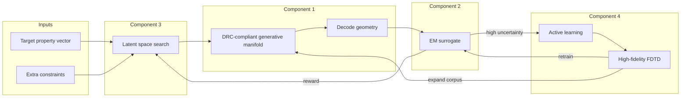

# Nanophotonics Inverse Design — Project Context

**Last updated:** 2026-06-08  
**Status:** Research benchmark + open-source release (`v1.0-preprint`)  
**Audience:** Adopters, collaborators, and future agents — use this document for architecture context. Public entry point: [OPEN_SOURCE_RELEASE.md](OPEN_SOURCE_RELEASE.md).

---

## 1. Executive summary

This project is a **reproducible MEEP-gated search benchmark** for DRC-feasible **1×2 power splitters** on the `drcgenerator` manifold — published as simulation-only research, not deployment-ready PIC IP.

The implemented pattern is: **sample on-manifold → surrogate rank (optional pre-filter) → MEEP verify → append to corpus**. Under frozen MEEP recipe `phase0_v1`, we document verified split-ratio search results, sim-budget comparisons, and **honest negative results** (broadband flatness, morphology stress, IL tradeoffs).

**Public framing:** cite the preprint ([manuscript.pdf](preprint/manuscript.pdf)), Zenodo bundle ([ZENODO_RELEASE.md](ZENODO_RELEASE.md)), and [ADOPTERS.md](ADOPTERS.md) for extensions. Historical commercial wedge docs are archived under [archive/commercial/](archive/commercial/README.md).

**Long-term research direction:** extend the same closed-loop architecture — feasible manifold, fast surrogate, MEEP-gated search, active learning — to additional gates (broadband, IL, fab-aware stress) and device classes, with foundry validation explicitly out of scope for v1.

---

## 2. Purpose

### 2.1 What problem we solve

**Forward design** is understood: given a geometry, simulate optical response (FDTD, FEM, RCWA, etc.). It is expensive but automatable.

**Inverse design** is hard in three compounding ways:

1. **One-to-many** — many geometries produce similar spectra or S-parameters.
2. **Hard constraints** — foundry design rules (minimum feature size, spacing, connectivity), material bounds, and platform-specific rules are combinatorial; penalty methods do not guarantee feasibility along the optimization path.
3. **Extrapolation** — high-performance designs often lie outside the distribution of structures that have been fabricated or fully simulated; pure neural models interpolate and fail OOD.

### 2.2 What we are building

A **closed-loop inverse design platform** that:

- Searches only (primarily) within a **learned manifold of DRC-compliant geometries**.
- Scores candidates with a **millisecond-scale surrogate** instead of full-wave sim for every step.
- Uses **exploration-aware optimization** when the latent→property map is non-smooth.
- **Grows** surrogate and generative coverage via **active learning** on high-fidelity FDTD (and eventually fab feedback).

### 2.3 What we are not building (for now)

- Universal inverse design across chemistry, crystals, proteins, or mechanical structures.
- A replacement for commercial EDA (Lumerical, Ansys, Synopsys) — we accelerate the **design search** layer.
- Guaranteed optimality certificates — we aim for **empirically validated** designs with documented uncertainty.

---

## 3. Target domain

### 3.1 Area definition

| Term | Meaning in this project |
|------|-------------------------|
| **Nanophotonics** | Sub-wavelength and wavelength-scale structures: metasurfaces, gratings, resonators, couplers, multiplexers, mode converters. |
| **Silicon PIC** | Devices on SOI or related platforms, typically C-band (~1.5–1.6 µm), integrated with CMOS-compatible flows. |
| **Inverse design** | Specify target optical behavior → algorithm proposes geometry. |

### 3.2 Initial device classes (Phase 1 scope)

Prioritize **compact passive components** with well-defined figures of merit and existing inverse-design literature:

- Power splitters (e.g., 50/50, arbitrary ratio)
- Wavelength multiplexers / demultiplexers (duplexers)
- Mode converters (fundamental ↔ higher-order)
- Couplers and routing elements used in PIC building blocks

**Platforms (pick one for v1):**

- **Electron-beam lithography (EBL)** — flexible rules, common in research MPW.
- **Photolithography** — stricter DRC; higher commercial relevance.

Do not boil the ocean on full transceiver or active modulator design in v1 unless a partner demands it.

### 3.3 Applications and customers (why this market)

| Application | Relevance |
|-------------|-----------|
| **AI / hyperscale datacom** | Optical interconnects, co-packaged optics, high-density PIC transceivers — primary growth driver for silicon photonics. |
| **Telecom / 5G** | Established PIC demand. |
| **LiDAR / sensing** | Metasurface and PIC subsystems. |
| **R&D / MPW** | Universities and design houses running multi-project wafers. |

Market context (order of magnitude): PIC / silicon photonics is a **multi‑tens‑of‑billions** industry with strong CAGR; datacom transceivers are a large sub-segment. Exact TAM figures vary by report; treat market size as **validation of budget**, not as our wedge alone.

### 3.4 Why nanophotonics first (decision record)

Compared to other inverse-design domains (bulk crystals, small molecules, enzymes, aerospace TO), nanophotonics ranks highest because:

- **Manifold + DRC** is an active, validated paradigm ([learned DRC-compliant generative manifolds](https://arxiv.org/pdf/2602.03142), [drcgenerator](https://github.com/Photonic-Architecture-Laboratories/drcgenerator)).
- **Surrogate speedup** is extreme (FDTD hours → ms inference; adjoint + neural forward models widely published).
- **Label cost** for active learning is lower than DFT-scale materials discovery.
- **Time to physical validation** is weeks (MPW + optical bench), not years (synthesis).

---

## 4. Technical architecture

Four components solve the three ill-posedness modes **simultaneously** (not as disconnected tools).



### Component 1 — Generative reparameterization (feasible manifold)

- Train a generative model on a corpus of **known fabricable / DRC-clean** structures for a **specific platform** (PDK or rule deck).
- Candidate representation: prefer **flow matching** or other stable generative models for structured layouts; representation may be continuous permittivity maps, level-set, or binary masks depending on platform.
- **Design principle:** optimization variables live in latent space `z`; decoded `G(z)` is *biased* toward feasible designs — not a mathematical guarantee for every `z`.
- **Mitigation:** decode-time DRC checks, rejection sampling, periodic retraining as new fab/sim data arrives.

**Resolves:** constraint satisfaction along trajectory (partially one-to-many via distribution).

### Component 2 — Fast neural surrogate (property evaluation)

- Input: geometry (or latent decode); output: target properties (spectrum, S-params, insertion loss, etc.).
- Trained on: public FDTD datasets where available + **project-owned** simulations from active learning.
- Enables **thousands to millions** of surrogate evaluations per optimization run.

**Resolves:** tractability of the inner loop (connects to broader “Problem 1” surrogate work if applicable).

### Component 3 — Search over the manifold

- Problem: find `z` such that surrogate-predicted properties match targets subject to extra constraints (footprint, bandwidth, polarization, etc.).
- **Initial approach:** latent Bayesian optimization or evolutionary strategies; **RL with Lagrangian constraints** is optional if baselines fail on non-smooth latent→property maps.
- Do not commit to RL until simpler search is benchmarked.

**Resolves:** one-to-many via stochastic search; handles non-smooth landscapes.

### Component 4 — Active learning for extrapolation

- Epistemic uncertainty via **deep ensembles** (or equivalent).
- Acquisition: balance **exploration** (high uncertainty, OOD latent regions) vs **exploitation** (near Pareto frontier).
- Ground truth: **FDTD** (and later fab/optical measurement); add to surrogate and **retrain / expand** generative training set.
- **Critical tension:** frozen manifold limits novelty; **must** periodically refresh Component 1 with new DRC-valid structures from AL.

**Resolves:** extrapolation over time; builds proprietary data moat.

---

## 5. Goals

### 5.1 North-star goal

Deliver a system where a photonics engineer can specify a target optical response and receive a **DRC-clean layout** that **meets spec within validated tolerance** after at most one MPW iteration — with **order-of-magnitude less** human iteration and full-wave sim spend than pixel-based adjoint-only workflows.

### 5.2 Phase goals

**Operational roadmap:** [ROADMAP.md](ROADMAP.md) (target Phase 0 in **7–10 days**; conservative 4-week map retained there).

| Phase | Goal | Horizon (indicative) |
|-------|------|----------------------|
| **0 — Foundation** | Single PDK/rule deck; corpus of DRC-valid devices + FDTD labels; baseline surrogate accuracy documented on held-out structures. | **7–10 days** (target) or ~4 weeks (conservative) |
| **1 — Inverse loop** | End-to-end: target spec → latent search → decode → surrogate rank → top-k full FDTD verify. Beat random/manifold sampling on fixed benchmarks. | Weeks 2–8 after Phase 0 |
| **2 — Active learning** | Closed loop reduces sim error in OOD regions; demonstrable expansion of “reliable” property coverage. | Phase 1 continuation |
| **3 — Fab validation** | At least one device class fabricated on MPW; optical measurement within agreed margin of sim. | Months 3–12 |
| **4 — Product** | Repeatable workflow for external pilot (design house or optics team); API or scripted pipeline. | 12+ months |

**Environment:** Python **`3.12.12` exactly** for `drcgenerator` — see [INSTALL.md](INSTALL.md).

### 5.3 Non-goals for Phase 0–1

- Multi-platform PDK support in one model.
- Full PIC circuit synthesis (place & route, system-level).
- Active devices (modulators, lasers) unless explicitly scoped later.
- Claims of “every latent point is fab-perfect” without measurement.

---

## 6. Success metrics and kill criteria

### 6.1 Metrics

| Metric | What good looks like (directional) |
|--------|----------------------------------|
| **Decode feasibility rate** | High % of latent samples pass DRC checker without post-hoc repair. |
| **Surrogate accuracy** | Low error on held-out geometries; ensemble disagreement correlates with FDTD error. |
| **Inverse hit rate** | Top-k surrogate candidates include ≥1 design within spec after FDTD (k small, e.g. 10–50). |
| **Sim budget efficiency** | Fewer FDTD runs per successful design vs pixel optimization or naive BO baseline. |
| **Compute time** | Wall-clock design cycle dominated by verification sims, not search. |
| **Fab correlation** | Measured spectrum/S-params within agreed tolerance of verified sim (Phase 3). |

### 6.2 Kill / pivot criteria

Consider pivoting approach (not necessarily domain) if:

- Manifold decode passes DRC at **low rates** without expensive repair — representation or corpus is wrong.
- Surrogate error on **wavelength / geometry extrapolation** does not improve after bounded AL budget.
- Latent search **never beats** strong baseline (adjoint + projection, or conditional gen) on same sim budget.
- No path to **MPW partner** within agreed timeline — photonics value requires physical validation.

---

## 7. Competitive and scientific context

### 7.1 Alternatives we must respect

- **Adjoint + gradient** topology optimization (Lumerical, custom Tidy3D/JAX workflows) — strong when physics is differentiable and DRC handled by projection/filters.
- **Learned DRC manifolds** — recent academic state of the art; our Component 1 aligns with this line ([arXiv:2602.03142](https://arxiv.org/pdf/2602.03142)).
- **Foundation photonics models** (e.g., contrastive / large-scale metasurface datasets) — fast screening; may be partner or pretraining source.
- **Commercial PIC design flows** — integration matters more than raw algorithm in enterprise sales.

### 7.2 Differentiation thesis

Win on **coupling**: feasible-by-representation search + surrogate-limited inner loop + **sim budget policy** that grows the manifold — not on “we use flow matching instead of diffusion.”

Proprietary value accumulates in **PDK-specific sim + fab outcome datasets**, not in public pretrained weights alone.

---

## 8. Key references (starting bibliography)

| Topic | Reference |
|-------|-----------|
| DRC-compliant generative manifold | [Intrinsically DRC-Compliant Nanophotonic Design via Learned Generative Manifolds](https://arxiv.org/pdf/2602.03142) — code: [drcgenerator](https://github.com/Photonic-Architecture-Laboratories/drcgenerator) |
| Manifold learning for metasurfaces | [arXiv:2102.04454](https://arxiv.org/abs/2102.04454) |
| Neural adjoint / surrogate inverse design | e.g. [PMC11926960](https://pmc.ncbi.nlm.nih.gov/articles/PMC11926960/) |
| Multi-fidelity photonic infrastructure | [MAPS (arXiv:2503.01046)](https://arxiv.org/abs/2503.01046) |
| Foundation-scale nanophotonic inverse design | [MOCLIP](https://arxiv.org/html/2511.18980) |
| Active learning + binary/CNN surrogates | [Sci Rep 2025 — CNN-IBO](https://www.nature.com/articles/s41598-025-99570-z) |

Extend this list as implementation choices solidify (simulator, PDK, representation).

---

## 9. Open decisions (track and resolve)

| ID | Decision | Options / notes |
|----|----------|-----------------|
| D1 | **Simulator** | Tidy3D, Lumerical, MEEP, custom FDTD — drives dataset format and adjoint availability. |
| D2 | **Representation** | Pixel mask, level-set, spline/parameterized cells — affects generative model choice. |
| D3 | **Platform v1** | EBL vs photolithography rule deck. |
| D4 | **Search algorithm** | BO / CMA-ES / RL — benchmark before committing. |
| D5 | **Training corpus source** | Synthetic from known good layouts, published datasets, partner PDK structures. |
| D6 | **Repository layout** | Code lives under `~/nanophotonics-inverse-design/` (this doc’s home). |

---

## 10. Repository and document map

```
nanophotonics-inverse-design/
  docs/
    PROJECT_CONTEXT.md    ← this file (purpose, goals, architecture)
    INSTALL.md            ← Python 3.12.12 + drcgenerator setup
    ROADMAP.md            ← sprint timeline (7–10 day Phase 0 target)
    PHASE0_GETTING_STARTED.md
  # Planned (not yet created):
  # src/                  — training, search, simulation adapters
  # data/                 — geometries, sim results, manifests
  # configs/              — PDK, wavelengths, device targets
```

When adding code, prefer updating this document’s **§5 Phase goals**, **§6 Metrics**, and **§9 Open decisions** rather than duplicating narrative in README alone.

---

## 11. Conversation lineage (for agents)

This project direction emerged from:

1. Review of a **four-component inverse design** proposal (manifold, surrogate, RL search, active learning) for general materials/science.
2. Critical analysis: strong thesis, but **manifold vs extrapolation tension** and **RL optional**.
3. Domain research ranking **nanophotonics / PIC** as Tier 1 for architecture fit and near-term ROI.
4. User decision: **start with nanophotonics** and produce this context document.

Related but **separate** repo: `~/scientific-discovery/` (literature/knowledge-graph engine — not this photonics build).

---

## 12. Glossary

| Term | Definition |
|------|------------|
| **DRC** | Design rule check — min width, spacing, etc. |
| **FDTD** | Finite-difference time-domain electromagnetic simulation. |
| **MPW** | Multi-project wafer — shared fab run for prototypes. |
| **PDK** | Process design kit — foundry rules and layer stack. |
| **PIC** | Photonic integrated circuit. |
| **SOI** | Silicon-on-insulator — common PIC platform. |
| **SUN** | Stable, unique, new (materials jargon; less central here). |
| **OOD** | Out-of-distribution — structures unlike training set. |
| **AL** | Active learning. |

---

*End of context document.*
