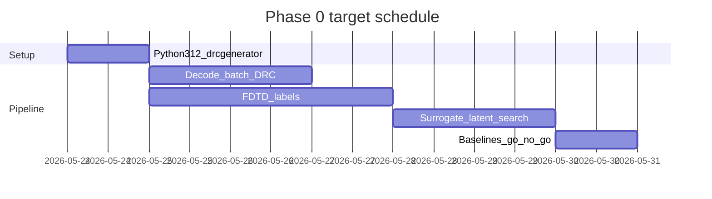

# Project roadmap

**Last updated:** 2026-05-25  
**Status:** **Phase 0 complete (go)** → [PHASE1_GETTING_STARTED.md](PHASE1_GETTING_STARTED.md)

Canonical context: [PROJECT_CONTEXT.md](PROJECT_CONTEXT.md).  
Install (exact Python): [INSTALL.md](INSTALL.md).  
Phase 0 tasks: [PHASE0_GETTING_STARTED.md](PHASE0_GETTING_STARTED.md).

---

## Timeline overview

Two views of the same plan:

| View | Duration | Notes |
|------|----------|--------|
| **Conservative** | ~4 weeks | Original week buckets; safe if sim queue or tooling is new |
| **Target (aggressive)** | **~7–10 days** | Parallel decode + sim; reuse `drcgenerator`; minimal custom ML until gate passes |

We are executing the **target** schedule unless blocked by simulator access or FDTD setup.



---

## Phase 0 — Prove the loop (target: 7–10 days)

**Benchmark:** EBL 50/50 power splitter, C-band — [configs/phase0.yaml](../configs/phase0.yaml)

| Sprint | Days | Deliverable | Exit criteria |
|--------|------|-------------|---------------|
| **0 — Setup** | 1 | Python **3.12.12** venv, `drcgenerator` import, one EBL decode | `python -c "import drcgenerator"` OK — **done** |
| **1 — Decode** | 1–2 | `decode_batch.py`, 500+ masks, DRC/heuristic report | Manifest + pass rate logged — **script ready** |
| **2 — Label** | 2–4 | 200+ MEEP runs, frozen [sim_recipe_phase0.md](sim_recipe_phase0.md) | `data/phase0/sim_results.csv` — **you are here** |
| **3 — Inverse** | 2–3 | Surrogate + latent BO; verify top-10 FDTD | ≥1 design in spec; top-k beats random |
| **4 — Gate** | 1 | [phase0_results.md](phase0_results.md) | **Go** — `meep_bo_00093` @ 0.497 |

**Phase 0 complete.** Champion: MEEP-native search (`phase0_v1`), not surrogate BO.

**Parallelism:** Sprint 1 decode jobs can run while Sprint 2 sim recipe is drafted; start FDTD on a 50–100 sample pilot before full batch finishes.

---

## Phase 1 — Own the stack (active)

**Start:** [PHASE1_GETTING_STARTED.md](PHASE1_GETTING_STARTED.md)

| Milestone | Goal |
|-----------|------|
| **1a** | Full `phase0_v1` relabel (500 perturb) + `data/phase1/` layout |
| **1b** | MEEP-native search 200+ trials; confirm champions with resim |
| **1c** | Mask surrogate on v1 — BO only if R² &gt; 0 |
| **1d** | Active learning (MEEP labels on high-value candidates) |
| **1e** | Template/fab: export mask, MPW narrative |
| **1f** | Deep dev: multi-objective search, surrogate-ranked AL, GDS — [PHASE1_DEEP_DEV.md](PHASE1_DEEP_DEV.md) |
| **1g** | **Wedge A** — sim-budget on-manifold — [WEDGE_A.md](WEDGE_A.md) |
| **1h** | **Differentiable ID (Danis hybrid)** — [DIFFERENTIABLE_INVERSE_DESIGN.md](DIFFERENTIABLE_INVERSE_DESIGN.md) |

**Horizon:** ~4–8 weeks.

---

## Phase 2 — Physical validation

| Milestone | Goal |
|-----------|------|
| **2a** | MPW or collaborator fab for best Phase 1 design |
| **2b** | Optical bench vs simulation report |
| **2c** | Process variation / robustness targets |

---

## Phase 3 — Product / pilot

Repeatable pipeline for external design partner: spec in → ranked GDS/mask candidates + uncertainty report out.

---

## Command cheat sheet (Day 1 — copy/paste)

```bash
cd ~/nanophotonics-inverse-design
bash scripts/setup.sh
source .venv/bin/activate
which python && python --version   # .venv/bin/python, 3.12.12
```

See [INSTALL.md](INSTALL.md) if you see `3.14.0 not in '==3.12.12'` — that means system `pip` was used, not the venv.

Next commands:

```bash
source ~/nanophotonics-inverse-design/.venv/bin/activate
uv pip install -r requirements-phase0.txt --python .venv/bin/python
python scripts/verify_setup.py
python scripts/decode_batch.py --n-samples 500 --preview-png
```

---

## Decision log

| Date | Decision | Rationale |
|------|----------|-----------|
| 2026-05-24 | First vertical: nanophotonics / PIC | Best fit for manifold + surrogate + fast validation |
| 2026-05-24 | Phase 0 device: EBL 50/50 splitter | `drcgenerator` ships this benchmark |
| 2026-05-24 | Python **==3.12.12** required | Upstream `pyproject.toml` pin |
| 2026-05-24 | Target Phase 0 in **7–10 days** | Aggressive but feasible with reuse + parallel sim |

---

## Scripts roadmap

| Script | Sprint | Status |
|--------|--------|--------|
| `scripts/setup.sh` | 0 | Done |
| `scripts/verify_setup.py` | 0 | Done |
| `scripts/decode_batch.py` | 1 | Done |
| `scripts/run_fdtd_batch.py` | 2 | Planned |
| `scripts/train_surrogate.py` | 3 | Planned |
| `scripts/latent_search.py` | 3 | Planned |
