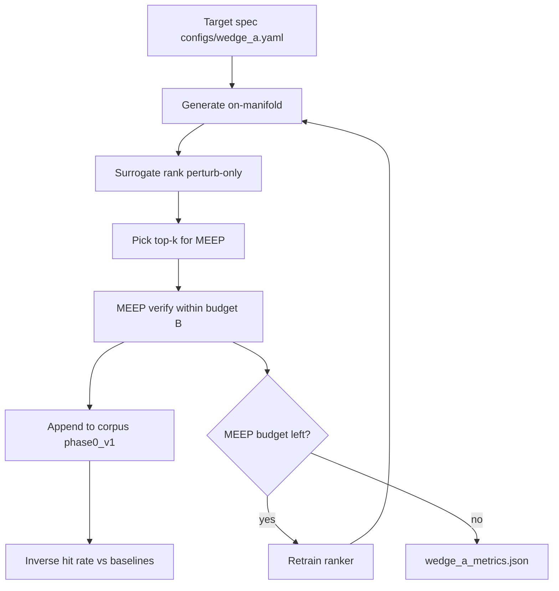

# Wedge A — Sim-budget inverse design on-manifold

> **Historical positioning — research release supersedes commercial framing.**  
> For public citation and adoption, start with [OPEN_SOURCE_RELEASE.md](OPEN_SOURCE_RELEASE.md) and [ADOPTERS.md](ADOPTERS.md). This doc remains the technical reference for sim-budget policies and Wedge A scripts.

**Status:** Active engineering reference (March 2026)  
**Canonical context:** [PROJECT_CONTEXT.md](PROJECT_CONTEXT.md)  
**Pilot / outreach:** [PILOT_README.md](PILOT_README.md) — `bash scripts/run_pilot.sh --report-only`  
**Supersedes:** ad-hoc Track B exploration until Tier 1 metrics exist

---

## Product claim (narrow)

**Primary:** Find **on-manifold layouts that meet optical spec** in a frozen MEEP recipe where the published reference does not — including **far-from-template** (Perlin) geometries experts would not reach by σ-tuning around a known-good layout. See [VALUE_PROPOSITION.md](VALUE_PROPOSITION.md) and `data/phase1/novelty/`.

**Supporting (verified, 5× replicate):** At **B=100**, surrogate pre-filter **15.0 ± 3.2** in-spec vs **10.6 ± 4.8** σ-only ([SIM_BUDGET_REPLICATION_RESULTS.md](SIM_BUDGET_REPLICATION_RESULTS.md)).

**Process:** MEEP-native search on the DRC-feasible manifold; surrogate **pre-filters** candidates only. **MEEP promotes; surrogate does not sign off.** Negative val R² is expected — sell ranking + verification, not regression.

---

## Architecture (target)

**Orchestrators**

| Script | Role |
|--------|------|
| `scripts/train_wedge_a_surrogate.py` | Default **perturb `latent_mlp`** ranker |
| `scripts/run_sim_budget_study.py` | Tier 1 sim-budget matrix |
| `scripts/run_wedge_a_round.py` | Acquisition round (propose → MEEP k → retrain → ranking gate) |
| `bash scripts/run_wedge_a.sh` | Pilot entry point |

---

## Success metrics (from PROJECT_CONTEXT §6.1)

| Metric | Definition | Gate |
|--------|------------|------|
| **Inverse hit rate** | P(≥1 in-spec in top-k) after MEEP on surrogate shortlist | Must beat random top-k |
| **Sim-budget curve** | Best split vs target at MEEP budgets 30 / 50 / 100 | Compare policies at equal B |
| **Ranking wins** | Surrogate top-k MAE &lt; random top-k on held-out MEEP labels | Required after each train |
| **Val R²** | Holdout regression | Informational only — **not** a gate |

**In-spec:** `|split_ratio_upper − target| ≤ tolerance` (default 0.05).

---

## Technical backlog

### Tier 1 — Must do (defines wedge A)

| # | Item | Implementation |
|---|------|----------------|
| 1 | Sim-budget study infrastructure | `run_sim_budget_study.py`, `configs/wedge_a.yaml` |
| 2 | Inverse hit rate gate | `evaluate_surrogate_ranking.py` + `nano_inv/sim_budget.py` |
| 3 | Budget-matched latent vs σ | `latent_meep_search.py --meep-budget` (future); study compares at equal B |
| 4 | Perturb-only ranker | `train_wedge_a_surrogate.py` → `data/phase1/wedge_a/surrogate` |

**Policies in sim-budget study**

| Policy | MEEP usage |
|--------|------------|
| `random_perturb` | B random DRC-pass σ-perturbations |
| `sigma_meep` | B trials Optuna on σ |
| `surrogate_rank` | M proposals (cheap), MEEP top B by surrogate score |
| `hierarchical` | B/2 σ search, then MEEP B/2 on surrogate top around best σ |

### Tier 2 — High leverage

| # | Item | Notes |
|---|------|--------|
| 5 | `run_wedge_a_round.py` | SimBudgetRound: propose → MEEP k → merge → retrain → ranking |
| 6 | Hierarchical σ → tight latent | After Tier 1 shows σ wins at equal B |
| 7 | Champion seed bank | Centers: ref, local_00022, meep_bo_00128 |

### Tier 3 — Supporting (light)

- Frozen `phase0_v1` one-pager (champions, G1a)
- Broadband spot-check top-3 only
- IL as hard gate, split as primary FOM

### Tier 4 — Explicitly deferred

- Surrogate-only BO
- Full high-D latent search without budget match
- Mixed perlin+perturb ranker training
- Template co-search at scale
- Fab / GDS / second device until Tier 1 report

---

## Frozen references (existence proof)

| Design | MEEP split @ phase0_v1 |
|--------|-------------------------|
| `local_00022` | 0.500 |
| `meep_bo_00128` | 0.509 |
| `meep_bo_00093` | 0.497 |

Corpus: `data/phase0/sim_results_phase0_v1_all.csv`

---

## Decision filter

Before new engineering, ask:

1. Does it improve **MEEP calls per in-spec design** or **P(hit in top-k)**?
2. Is it compared at **fixed MEEP budget** to `random_perturb` and `sigma_meep`?
3. Does promotion require **MEEP**, not surrogate alone?

If no to all three → backlog, not wedge A.

---

## Artifacts

| Path | Content |
|------|---------|
| `data/phase1/wedge_a/surrogate/` | Perturb latent_mlp ranker |
| `data/phase1/wedge_a/sim_budget/` | Per-policy, per-budget results |
| `data/phase1/wedge_a/wedge_a_metrics.json` | Aggregated study report |
| `data/phase1/wedge_a/rounds/round_NN/` | AL-style rounds |

---

## Production sim-budget results (5× replicate, 2026-05-26)

**Full write-up:** [SIM_BUDGET_REPLICATION_RESULTS.md](SIM_BUDGET_REPLICATION_RESULTS.md)  
**Aggregate:** `data/phase1/wedge_a/sim_budget_replication_report.md`  
**Figure:** `data/phase1/wedge_a/sim_budget_replication_errorbars.png`

**B=100 (mean ± std, n=5):**

| Policy | n_in_spec | best_abs_err |
|--------|-----------|--------------|
| **surrogate_rank** | **15.0 ± 3.2** | **0.0042 ± 0.0031** |
| hierarchical_35 | 14.8 ± 3.5 | 0.0052 ± 0.0029 |
| random_perturb | 12.8 ± 1.8 | 0.0058 ± 0.0061 |
| sigma_meep | 10.6 ± 4.8 | 0.0074 ± 0.0070 |

**Readout:** Surrogate pre-filter is **best or tied** on in-spec yield and **best** on promoted design quality at B=100. `hierarchical_35` is the strongest σ-tuned baseline. Results are **moderately positive** for the supporting wedge — not a clean sweep at all budgets.

## Pilot sim-budget (historical, single seed)

Budgets **15** and **30** only — `data/phase1/wedge_a/wedge_a_metrics.json`. Superseded for external claims by replication results above.

---

## Changelog

| Date | Note |
|------|------|
| 2026-05-26 | 5× replicate sim-budget B=30/50/100 complete |
| 2026-05-26 | Pilot sim-budget study complete |
| 2026-05-26 | Wedge A selected; Tier 1 implementation started |
